<br>
<h1 align=center><font size=6>Projet final du Kit Data Science 2021</font></h1>
<h2 align=center><font size=5>Analyse des données du Vendée Globe 2020-2021</font></h2>
<h3 align=center>Louis BEAULIEU - MS BGD</h3>

<h2>Table des matières</h2>
<div class="alert alert-block alert-info" style="margin-top: 20px">
<ol>
    <h3><a href="#ref1">1 - Initialisation - Import des librairies utiles au projet</a></h3>
    <h3><a href="#ref2">2 - Récupération des données</a></h3>
    <h4 style="text-indent: 40px"><a href="#ref21"><i>2.1 - Récupération des fichiers de classements intermédiaires</i></a></h4>
    <h4 style="text-indent: 40px"><a href="#ref22"><i>2.2 - Récupération des caractéristiques des bateaux</i></a></h4>
    <h4 style="text-indent: 40px"><a href="#ref23"><i>2.3 - Traitement des fichiers de classements intermédiaires et fusion avec les caractéristiques des bateaux</i></a></h4>
    <h4 style="text-indent: 40px"><a href="#ref24"><i>2.4 - Normalisation des valeurs en vue des travaux d'analyse</i></a></h4>
    <h3><a href="#ref3">3 - Analyse descriptive / data vizualisation</a></h3>
    <h4 style="text-indent: 40px"><a href="#ref31"><i>3.1 - Corrélation entre la VMG et le rang des concurrents</i></a></h4>
    <h4 style="text-indent: 40px"><a href="#ref32"><i>3.2 - Impact de la présence d'un foil sur la VMG</i></a></h4>
    <h4 style="text-indent: 40px"><a href="#ref33"><i>3.3 - distance parcourue par les voiliers</i></a></h4>
    <h4 style="text-indent: 40px"><a href="#ref34"><i>3.4 - Visualisation de la route d'un voilier</i></a></h4>
    <h4 style="text-indent: 40px"><a href="#ref35"><i>3.5 - Analyse des relations entres les variables</i></a></h4>
    <h3><a href="#ref4">4 - Analyse prédictive</a></h3>
</ol>
</div>

<h1 id="ref1">1 - Initialisation - Import des librairies utiles au projet</h1>


```python
import pandas as pd
import numpy as np
import folium
from folium.plugins import MarkerCluster
from folium.features import CustomIcon
from bs4 import BeautifulSoup
import requests
import urllib
import datetime
import glob
import seaborn as sns
import matplotlib.pyplot as plt
import plotly.express as px
from sklearn.preprocessing import OneHotEncoder
from sklearn.preprocessing import StandardScaler
from sklearn.decomposition import PCA
from sklearn import linear_model
from sklearn.linear_model import LogisticRegression
from sklearn.svm import SVC
from sklearn.ensemble import GradientBoostingClassifier
from sklearn.model_selection import train_test_split
from sklearn import metrics
from sklearn.metrics import roc_curve, auc
from sklearn.metrics import roc_auc_score
from sklearn.preprocessing import label_binarize
from sklearn.model_selection import cross_val_score
```

<h1 id="ref2">2 - Récupération des données</h1>

<h2 id="ref21">2.1 - Récupération des fichiers de classements intermédiaires</h2>


```python
# Récupération de la liste des fichiers de classement
url = 'https://www.vendeeglobe.org/fr/classement/20210305_080000'
page = requests.get(url).content
soup = BeautifulSoup(page)
pages_classements = []
for item in soup.find_all('option'):
    pages_classements.append(item.get('value'))
del pages_classements[0]

print("Il y a " + str(len(pages_classements)) + " pages de classement.")
print("Les 5 premières valeurs de la liste sont : \n"
      + str(pages_classements[0:5]))
```

    Il y a 706 pages de classement.
    Les 5 premières valeurs de la liste sont : 
    ['20210305_080000', '20210305_040000', '20210304_210000', '20210304_170000', '20210304_140000']


```python
# Téléchargement des fichiers
for i in range(len(pages_classements)):
    path = 'https://www.vendeeglobe.org/download-race-data/vendeeglobe_{}.xlsx'
    idd = pages_classements[i]
    fichier_source = path.format(idd)
    fichier_cible = 'classements/vendeeglobe_{}.xlsx'.format(idd)
    # Ligne ci-dessous commentée pour éviter un retéléchargement accidentel
    # urllib.request.urlretrieve(fichier_source, fichier_cible)

print('Téléchargement des résultats terminé')
```

    Téléchargement des résultats terminé


<h2 id="ref22">2.2 - Récupération des caractéristiques des bateaux</h2>

### 2.2.1 - Acquisition des caractéristiques des bateaux


```python
url = 'https://www.vendeeglobe.org/fr/glossaire'
page = requests.get(url).content
soup = BeautifulSoup(page)

dico = {}
table = soup.find_all(class_="sv-u-1 sv-u-s-1-2 sv-u-m-1-3 sv-u-l-1-6")

# Liste des caractéristiques des bateaux
features = ['Numéro de voile', 'Date de lancement', 'Longueur',
            'Largeur', "Tirant d'eau", 'Déplacement (poids)',
            'Nombre de dérives', 'Hauteur mât',
            'Surface de voiles au près', 'Surface de voiles au portant']

# Déclaration des variables
voile = age = longueur = largeur = tirant \
    = poids = derives = hauteur_mat \
    = surf_voiles_pres = surf_voiles_portant = ''

# Liste des variables
variables = [voile, age, longueur, largeur, tirant,
             poids, derives, hauteur_mat,
             surf_voiles_pres, surf_voiles_portant]

# Récupération des caractéristiques
for t in table:
    selection = t.select(".boats-list__popup-specs-list li")
    skipper = t.find('span', {'class': 'boats-list__skipper-name'}).text
    for feat in range(len(features)):
        for i in range(len(selection)):
            if selection[i].text.split(':')[0].strip() == features[feat]:
                variables[feat] = selection[i].text.split(':')[1].strip()
                break
            else:
                variables[feat] = ''

    dico[skipper] = {
        'voile': variables[0],
        'age': variables[1],
        'longueur': variables[2],
        'largeur': variables[3],
        'tirant': variables[4],
        'poids': variables[5],
        'derives': variables[6],
        'hauteur_mat': variables[7],
        'surf_voiles_pres': variables[8],
        'surf_voiles_portant': variables[9]
    }

df_boat = pd.DataFrame(dico).T
```

### 2.2.2 - Mise en forme des caractéristiques des bateaux


```python
# Correction des numéros de voiles
df_boat.loc['Thomas RUYANT'].voile = 'FRA59'
df_boat.loc['Pip HARE'].voile = 'GBR777'
df_boat.loc['Boris HERRMANN'].voile = 'MON10'

# Normalisation des numéros de voiles
nat = ['FRA', 'ESP', 'GBR', 'FIN', 'ITA', 'SUI', 'JPN', 'MON']
for i in range(df_boat.shape[0]):
    if df_boat.voile.iloc[i][:3] in nat:
        df_boat.voile.iloc[i] = df_boat.voile.iloc[i][3:].strip()
df_boat.voile = df_boat.voile.astype(np.int64)

# Normalisation des longueurs, largeurs, tirants et hauteur mat
liste_m = df_boat.columns[2:5].tolist()
liste_m.append(df_boat.columns[7])
for col in liste_m:
    df_boat[col] = df_boat[col].map(lambda x: x[:-1]
                                    .strip()
                                    .replace(',', '.'))
    df_boat[col] = df_boat[col].astype(np.float64)

# Normalisation des surfaces de voiles
liste_v = df_boat.columns[8:10].tolist()
for col in liste_v:
    df_boat[col] = df_boat[col].map(lambda x: x[:3])
    df_boat[col] = df_boat[col].astype(np.int64)

# Normalisation du poids
df_boat.poids = df_boat.poids.replace(['t', 'tonnes'], ' t', regex=True) \
    .map(lambda x: x.split()[0]) \
    .replace(['NC', 'nc'], np.nan) \
    .replace(',', '.', regex=True) \
    .astype(np.float64)
df_boat.poids.fillna(df_boat.poids.mean(), inplace=True)
df_boat.poids = round(df_boat.poids, 1)

# Normalisation du nombre de dérives et changement du nom de colonne
df_boat.derives = df_boat.derives.replace(['2', '2 asymétriques',
                                           'foiler', 'foils'],
                                          [0, 0,
                                           1, 1])
df_boat.rename(columns={'derives': 'foils'}, inplace=True)

# Suppression des colonnes constantes pour tous les bateaux
df_boat.drop(columns=['longueur', 'tirant'], inplace=True)

# Gestion de l'âge du bateau en fonction de la date de sortie
debut_course = pd.to_datetime("2020-11-08", dayfirst=True)

# Match nom du mois <-> numéro du mois en vue d'une conversion en Datetime
key_list = df_boat.age.str.split(' ', expand=True)[1].unique().tolist()
value_list = [8, 3, 6, 2, 9, 1, 7, 5, 4]
mois = {}
for i in range(len(key_list)):
    mois[key_list[i]] = value_list[i]

df_boat.age = df_boat.age.map(lambda x: str(x.split(' ')[0])
                              + "-" + str(mois[x.split(' ')[1]])
                              + "-" + str(x.split(' ')[2]))
df_boat.age = df_boat.age.map(lambda x: debut_course
                              - pd.to_datetime(x, dayfirst=True)) \
    / np.timedelta64(1, "D")

df_boat.age = df_boat.age.astype(np.int64)
```


```python
df_boat.head()
```


<div>
<style scoped>
    .dataframe tbody tr th:only-of-type {
        vertical-align: middle;
    }

    .dataframe tbody tr th {
        vertical-align: top;
    }

    .dataframe thead th {
        text-align: right;
    }
</style>
<table border="1" class="dataframe">
  <thead>
    <tr style="text-align: right;">
      <th></th>
      <th>voile</th>
      <th>age</th>
      <th>largeur</th>
      <th>poids</th>
      <th>foils</th>
      <th>hauteur_mat</th>
      <th>surf_voiles_pres</th>
      <th>surf_voiles_portant</th>
    </tr>
  </thead>
  <tbody>
    <tr>
      <th>Fabrice AMEDEO</th>
      <td>56</td>
      <td>1926</td>
      <td>5.85</td>
      <td>7.0</td>
      <td>1</td>
      <td>29.0</td>
      <td>320</td>
      <td>570</td>
    </tr>
    <tr>
      <th>Romain ATTANASIO</th>
      <td>49</td>
      <td>4994</td>
      <td>5.80</td>
      <td>9.0</td>
      <td>0</td>
      <td>28.0</td>
      <td>280</td>
      <td>560</td>
    </tr>
    <tr>
      <th>Alexia BARRIER</th>
      <td>72</td>
      <td>8288</td>
      <td>5.54</td>
      <td>9.0</td>
      <td>0</td>
      <td>29.0</td>
      <td>260</td>
      <td>580</td>
    </tr>
    <tr>
      <th>Yannick BESTAVEN</th>
      <td>17</td>
      <td>2068</td>
      <td>5.80</td>
      <td>8.0</td>
      <td>1</td>
      <td>29.0</td>
      <td>310</td>
      <td>550</td>
    </tr>
    <tr>
      <th>Jérémie BEYOU</th>
      <td>8</td>
      <td>813</td>
      <td>5.85</td>
      <td>8.0</td>
      <td>1</td>
      <td>29.0</td>
      <td>320</td>
      <td>600</td>
    </tr>
  </tbody>
</table>
</div>


<h2 id="ref23">2.3 - Traitement des fichiers de classements intermédiaires et fusion avec les caractéristiques des bateaux</h2>


```python
%%time


def prepa_dataframe(file):
    # Ouverture du fichier
    df = pd.read_excel(file, skiprows=3)

    # Définition des noms de colonnes
    df.rename(columns={
        df.columns[1]: 'rang', df.columns[2]: 'voile',
        df.columns[3]: 'skipper/bateau', df.columns[4]: 'heure',
        df.columns[5]: 'lat', df.columns[6]: 'lng',
        df.columns[7]: 'cap_30mn', df.columns[8]: 'vitesse_30mn',
        df.columns[9]: 'vmg_30mn', df.columns[10]: 'dist_30mn',
        df.columns[11]: 'cap_last', df.columns[12]: 'vitesse_last',
        df.columns[13]: 'vmg_last', df.columns[14]: 'dist_last',
        df.columns[15]: 'cap_24h', df.columns[16]: 'vitesse_24h',
        df.columns[17]: 'vmg_24h', df.columns[18]: 'dist_24h',
        df.columns[19]: 'dtf', df.columns[20]: 'dtl'}, inplace=True)

    # Nettoyage de la structure du DataFrame
    df.drop([0], inplace=True)
    df.drop([34, 35, 36, 37], inplace=True)
    df.drop(columns=df.columns[0], inplace=True)

    # Définition de la date et de l'heure du relevé à l'aide du nom du fichier
    df['date_heure'] = file[-24:-20] + "/" + file[-20:-18] + "/" \
        + file[-18:-16] + " " + file[-15:-13] + ":" + file[-13:-11]
    df['date_heure'] = pd.to_datetime(df['date_heure'])

    # Séparation skipper/bateau et déplacement colonnes en début de DataFrame
    df[['skipper', 'bateau']] = df['skipper/bateau'] \
        .str.split('\n', expand=True)
    cols = df.columns.tolist()
    cols = cols[-3:] + cols[:-3]
    df = df[cols]

    # Suppression des colonnes inutiles
    df.drop(columns=['skipper/bateau', 'bateau', 'heure'], inplace=True)

    # Normalisation des numéros de voiles
    df.voile = df.voile.map(lambda x: x.split(' ')[1].strip()).astype(np.int64)

    # Normalisation du rang
    df.rang = df.rang.replace(['NL', 'RET'], 999, regex=True)
    df.rang = df.rang.astype(np.int64)

    # Normalisation des colonnes de mesures
    liste_col = df.columns[6:20].tolist()
    for col in liste_col:
        df[col] = df[col].replace(['°', ' kts', ' nm'], '', regex=True)
        df[col] = df[col].astype(np.float64)

    return df


files = sorted(glob.glob('classements/*.xls'), reverse=True)
dfs = []
for file in files:
    dfs.append(prepa_dataframe(file))
df = pd.concat(dfs, ignore_index=True).merge(df_boat, on='voile', how='left')
df = df.set_index(['date_heure'])
print("Concaténation terminée")
```

    Concaténation terminée
    CPU times: user 9.4 s, sys: 104 ms, total: 9.5 s
    Wall time: 9.5 s


<h2 id="ref24">2.4 - Normalisation des valeurs en vue des travaux d'analyse</h2>


```python
# On supprime les lignes qui correspondent aux abandons
df = df.dropna()

# On neutralise les vitesses négatives
df[df['vmg_24h'] < 0] = 0
df[df['vmg_last'] < 0] = 0
df[df['vmg_30mn'] < 0] = 0

# On supprime les lignes de valeurs nulles
df = df[df['rang'] != 0]

# Conversion des coordonnées géographiques
deg_lat = df.lat.map(lambda x: x.split('°')[0]).astype(np.int64)
mn_lat = df.lat.map(lambda x: x.split('°')[1]
                    .split('.')[0]).astype(np.int64)
sec_lat = df.lat.map(lambda x: x.split('°')[1].split('.')[1]
                     .split("'")[0]).astype(np.int64)

deg_lng = df.lng.map(lambda x: x.split('°')[0]).astype(np.int64)
mn_lng = df.lng.map(lambda x: x.split('°')[1]
                    .split('.')[0]).astype(np.int64)
sec_lng = df.lng.map(lambda x: x.split('°')[1]
                     .split('.')[1].split("'")[0]).astype(np.int64)

signe_lat = df.lat.map(lambda x: x.split("'")[1]) \
    .replace(['N', 'S'], [1, -1])
signe_lng = df.lng.map(lambda x: x.split("'")[1]) \
    .replace(['E', 'W'], [1, -1])

df.lat = (deg_lat + mn_lat/60 + sec_lat/3600)*signe_lat
df.lng = (deg_lng + mn_lng/60 + sec_lng/3600)*signe_lng

df.head()
```


<div>
<style scoped>
    .dataframe tbody tr th:only-of-type {
        vertical-align: middle;
    }

    .dataframe tbody tr th {
        vertical-align: top;
    }

    .dataframe thead th {
        text-align: right;
    }
</style>
<table border="1" class="dataframe">
  <thead>
    <tr style="text-align: right;">
      <th></th>
      <th>skipper</th>
      <th>rang</th>
      <th>voile</th>
      <th>lat</th>
      <th>lng</th>
      <th>cap_30mn</th>
      <th>vitesse_30mn</th>
      <th>vmg_30mn</th>
      <th>dist_30mn</th>
      <th>cap_last</th>
      <th>...</th>
      <th>dist_24h</th>
      <th>dtf</th>
      <th>dtl</th>
      <th>age</th>
      <th>largeur</th>
      <th>poids</th>
      <th>foils</th>
      <th>hauteur_mat</th>
      <th>surf_voiles_pres</th>
      <th>surf_voiles_portant</th>
    </tr>
    <tr>
      <th>date_heure</th>
      <th></th>
      <th></th>
      <th></th>
      <th></th>
      <th></th>
      <th></th>
      <th></th>
      <th></th>
      <th></th>
      <th></th>
      <th></th>
      <th></th>
      <th></th>
      <th></th>
      <th></th>
      <th></th>
      <th></th>
      <th></th>
      <th></th>
      <th></th>
      <th></th>
    </tr>
  </thead>
  <tbody>
    <tr>
      <th>2021-01-27 14:00:00</th>
      <td>Charlie Dalin</td>
      <td>1</td>
      <td>79</td>
      <td>46.235278</td>
      <td>-3.700278</td>
      <td>39.0</td>
      <td>21.0</td>
      <td>16.0</td>
      <td>10.5</td>
      <td>37.0</td>
      <td>...</td>
      <td>334.3</td>
      <td>80.5</td>
      <td>0.0</td>
      <td>461</td>
      <td>5.85</td>
      <td>8.0</td>
      <td>1</td>
      <td>29.0</td>
      <td>350</td>
      <td>560</td>
    </tr>
    <tr>
      <th>2021-01-27 14:00:00</th>
      <td>Louis Burton</td>
      <td>2</td>
      <td>18</td>
      <td>46.417222</td>
      <td>-5.208333</td>
      <td>116.0</td>
      <td>17.8</td>
      <td>15.6</td>
      <td>9.2</td>
      <td>110.0</td>
      <td>...</td>
      <td>412.1</td>
      <td>141.5</td>
      <td>60.9</td>
      <td>1979</td>
      <td>5.80</td>
      <td>7.6</td>
      <td>1</td>
      <td>28.0</td>
      <td>300</td>
      <td>600</td>
    </tr>
    <tr>
      <th>2021-01-27 14:00:00</th>
      <td>Boris Herrmann</td>
      <td>3</td>
      <td>10</td>
      <td>44.529444</td>
      <td>-5.348611</td>
      <td>130.0</td>
      <td>18.2</td>
      <td>3.4</td>
      <td>9.1</td>
      <td>113.0</td>
      <td>...</td>
      <td>323.5</td>
      <td>190.0</td>
      <td>109.5</td>
      <td>1920</td>
      <td>5.70</td>
      <td>7.6</td>
      <td>1</td>
      <td>29.0</td>
      <td>290</td>
      <td>490</td>
    </tr>
    <tr>
      <th>2021-01-27 14:00:00</th>
      <td>Thomas Ruyant</td>
      <td>4</td>
      <td>59</td>
      <td>47.411667</td>
      <td>-7.368889</td>
      <td>103.0</td>
      <td>17.6</td>
      <td>17.5</td>
      <td>8.8</td>
      <td>102.0</td>
      <td>...</td>
      <td>433.4</td>
      <td>235.8</td>
      <td>155.3</td>
      <td>432</td>
      <td>5.85</td>
      <td>8.0</td>
      <td>1</td>
      <td>29.0</td>
      <td>350</td>
      <td>560</td>
    </tr>
    <tr>
      <th>2021-01-27 14:00:00</th>
      <td>Yannick Bestaven</td>
      <td>5</td>
      <td>17</td>
      <td>47.727222</td>
      <td>-7.989167</td>
      <td>98.0</td>
      <td>18.4</td>
      <td>18.3</td>
      <td>9.2</td>
      <td>98.0</td>
      <td>...</td>
      <td>447.2</td>
      <td>264.3</td>
      <td>183.7</td>
      <td>2068</td>
      <td>5.80</td>
      <td>8.0</td>
      <td>1</td>
      <td>29.0</td>
      <td>310</td>
      <td>550</td>
    </tr>
  </tbody>
</table>
<p>5 rows × 26 columns</p>
</div>


<h1 id="ref3">3 - Analyse descriptive / data vizualisation</h1>

<h2 id="ref31">3.1 - Corrélation entre la VMG et le rang des concurrents</h2>


```python
# récupération des noms de colonnes contenant 'VMG'
var = [f for f in df.columns if "vmg" in f]
```


```python
fig = plt.figure(figsize=(20, 15))

for i, v in enumerate(var):
    ax = fig.add_subplot(3, 1, i+1)
    sns.boxplot(ax=ax, x="rang", y=v, data=df)

plt.show()
```


    
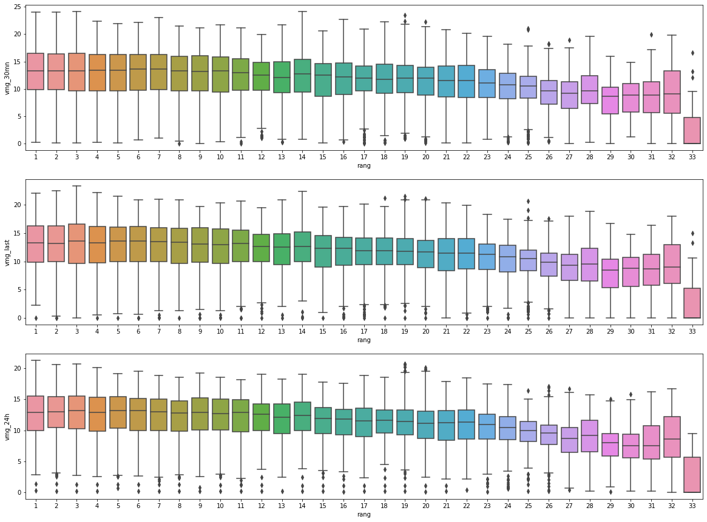
    


Pour les analyses à suivre, on se base sur la VMG depuis 24h, moins sujette à variations que les autres métriques


```python
linmod = linear_model.LinearRegression()
df_tmp = df[['rang', 'vmg_24h']].groupby(by='rang').mean().reset_index()

# On supprime un outlier
df_tmp = df_tmp[df_tmp['rang'] < 33]

X = df_tmp[['vmg_24h']]
Y = df_tmp['rang']
linmod.fit(X, Y)

print('En utilisant ''sklearn.linear_model'', les paramètres estimés sont:')
print('b0 = {:.4f},'.format(linmod.intercept_))
print('b1 = {:.4f}.'.format(linmod.coef_[0]))

print('\nCoefficient de détermination R^2 = {:.4f}.'
      .format(linmod.score(X, Y)))
```

    En utilisant sklearn.linear_model, les paramètres estimés sont:
    b0 = 76.8653,
    b1 = -5.4853.
    
    Coefficient de détermination R^2 = 0.8842.


```python
sns.lmplot(x='vmg_24h', y='rang', data=df_tmp,
           height=5, aspect=3)
plt.title('rang = f(vmg_24h)')
plt.show()
```


    
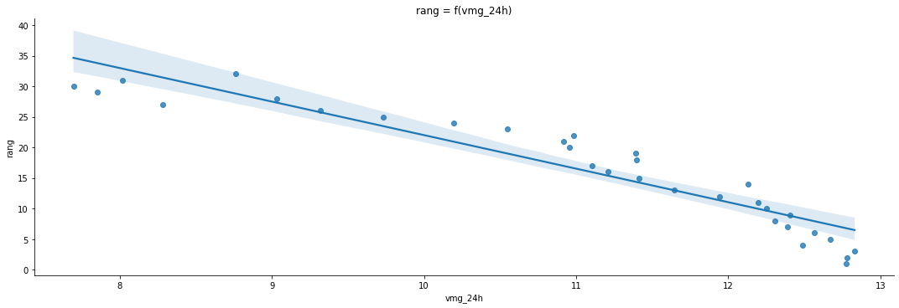
    


<h2 id="ref32">3.2 - Impact de la présence d'un foil sur la VMG</h2>


```python
fig = plt.figure(figsize=(12, 8))

for i, v in enumerate(var):
    ax = fig.add_subplot(1, 3, i+1)
    sns.boxplot(ax=ax, x="foils", y=v, data=df)

plt.show()
```


    
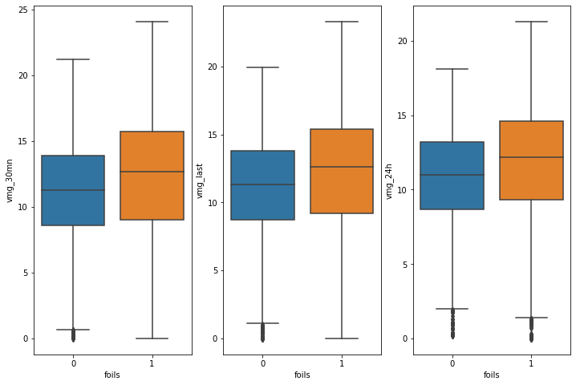
    


<h2 id="ref33">3.3 - distance parcourue par les voiliers</h2>


```python
# On étudie les skippers séparés de 5 places le dernier jour d'étude
skp = df[df.index == max(df.index)].sort_values(by='rang').skipper.tolist()
skp = skp[::5]
```


```python
df_dist = df[['skipper', 'dtf']].copy().reset_index()
df_dist = df_dist.query('skipper == @skp')
df_dist.insert(2, 'distance_parcourue', 24296 - df_dist['dtf'])
df_dist = df_dist.drop(columns='dtf') \
    .reset_index() \
    .groupby(by=['date_heure', 'skipper']) \
    .sum() \
    .reset_index()
df_dist = df_dist.pivot('date_heure', 'skipper', 'distance_parcourue')

sns.lineplot(data=df_dist)
sns.set(rc={'figure.figsize': (20, 10)})
plt.legend(title='Skippers', bbox_to_anchor=(1, 1), loc=2)
plt.title('Distance parcourue par les voiliers en fonction du temps', size=18)
plt.xlabel('Date de relevé', size=18)
plt.ylabel('Distance parcourue (nm)', size=18)
plt.show()
```


    
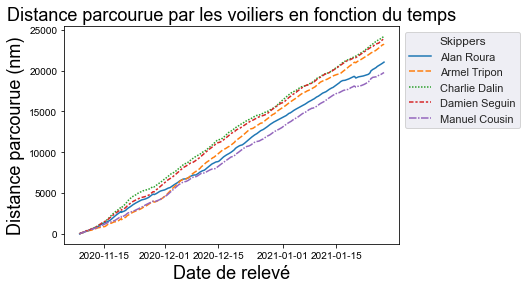
    


<h2 id="ref34">3.4 - Visualisation de la route d'un voilier</h2>


```python
fig = px.line_geo(df[df.skipper == 'Charlie Dalin'],
                  lat='lat',
                  lon='lng',
                  color='skipper',
                  facet_col='skipper',
                  facet_col_wrap=3,
                  facet_col_spacing=0.02,
                  facet_row_spacing=0.02)
fig.show()
```

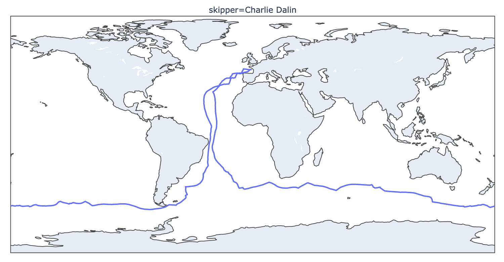

<h2 id="ref35">3.5 - Analyse des relations entre les variables</h2>


```python
X_foils = np.array(df['foils']).reshape(-1, 1)
enc = OneHotEncoder()
enc.fit(X_foils)
Foils_OHE = enc.transform(X_foils).toarray()
```


```python
df_corr = df[['vmg_last',
              'largeur',
              'poids',
              'surf_voiles_pres',
              'surf_voiles_portant',
              'hauteur_mat']]
```


```python
df_corr.insert(6, 'Foils OHE', Foils_OHE[:, 0])
```


```python
scaler = StandardScaler().fit(df_corr)
```


```python
df_corrCR = pd.DataFrame(scaler.transform(df_corr),
                         columns=df_corr.columns.tolist())
```


```python
fig = plt.figure(figsize=(10, 8))

sns.heatmap(df_corrCR.corr(), cmap="YlGnBu", annot=True)

plt.title("Matrice de corrélation des variables")
plt.show()
```


    
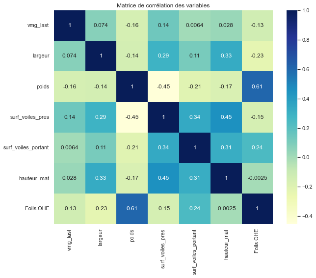
    


```python
fig = plt.figure(figsize=(10, 8))

pcaCR = PCA()
pcaCR.fit(df_corrCR)

ratios = pcaCR.explained_variance_ratio_

plt.bar(range(len(ratios)), ratios)
plt.xticks(range(len(ratios)))
plt.xlabel("Composante principale")
plt.ylabel("% de variance expliquée")
plt.show()
```


    
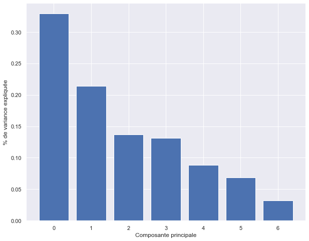
    


```python
df_corrNt = pcaCR.transform(df_corrCR)

df_corrCRTranspose = np.array(df_corrCR).transpose()
irlambdas = 1/np.sqrt(pcaCR.explained_variance_)
mirlambdas = np.diagflat(irlambdas)
projectionsVars =\
    (df_corrCRTranspose.dot(df_corrNt)).dot(mirlambdas)/df_corrCR.shape[0]
```


```python
def proj_var(comp1, comp2):
    fig = plt.figure(figsize=(8, 8))
    ax = fig.add_subplot(111)
    ax.set_xlim([-1, 1])
    ax.set_ylim([-1, 1])
    cercle = plt.Circle((0, 0), 1, color='b', fill=False)
    ax.add_artist(cercle)
    for i, var in enumerate(df_corrCR.columns):
        x, y = projectionsVars[i, comp1], projectionsVars[i, comp2]
        ax.scatter(x, y)
        ax.arrow(0, 0, x, y, shape='full', lw=1, length_includes_head=True)
        ax.text(x, y, var)

    ax.set_xlabel("Facteur 1 ({}%)".format(round(ratios[0] * 100, 1)))
    ax.set_ylabel("Facteur 2 ({}%)".format(round(ratios[1] * 100, 1)))
    plt.title("Projection des variables sur les axes des composantes {} et {}"
              .format(comp1+1, comp2+1))
    plt.grid()
    plt.show()
```


```python
proj_var(0, 1)
```


    
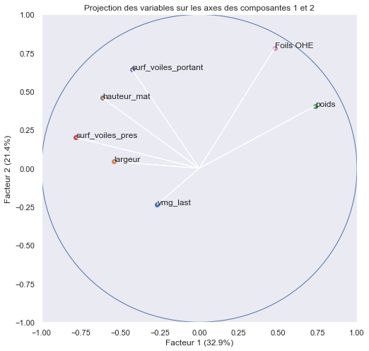
    


```python
proj_var(0, 2)
```


    
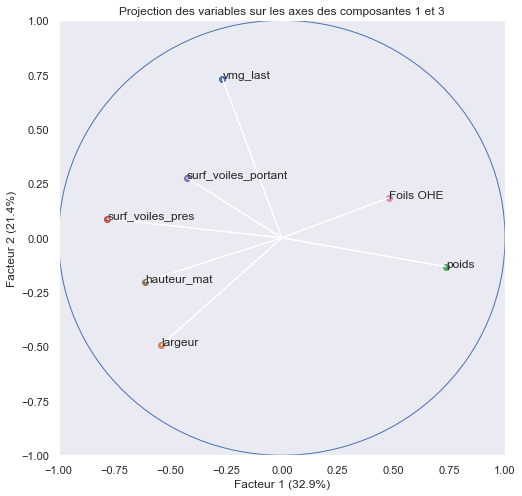
    


```python
proj_var(1, 2)
```


    
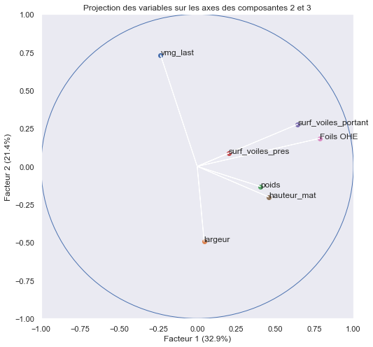
    


La matrice de corrélation et les projections des variables sur les 3 premiers axes principaux permettent d'identifier une légère corrélation positive entre le déplacement et la présence d'un foil.

<h1 id="ref4">4 - Analyse prédictive</h1>

Nous allons segmenter le rang des skippers en 4 classes :
- Les skippers entre le rang 1 et 5 seront assignés à la classe 1
- Les skippers entre le rang 6 et 10 seront assignés à la classe 2
- Les skippers entre le rang 11 et 15 seront assignés à la classe 3
- Les autres skippers (rang supérieur à 15) seront assignés à la classe 4

Notre objectif sera de prédire la classe du skipper à partir des variables suivantes :
- 'vmg_last'
- 'foils'
- 'largeur'
- 'surf_voiles_pres'
- 'surf_voiles_portant'
- 'hauteur_mat'
- 'poids'

Pour répondre à cette problématique, nous utiliserons trois familles d'algorithmes (modèle linéaire, modèle à noyau et modèle ensembliste) de classification supervisée. Nous testerons ainsi, un modèle de régression logistique, SVM et XGBoost et nous évaluerons leurs performances.


```python
def top_rang(x):
    if x <= 5:
        x = 1
    elif (x > 5) and (x <= 10):
        x = 2
    elif (x > 10) and (x <= 20):
        x = 3
    else:
        x = 4
    return x
```


```python
df_ml = df.copy()
```


```python
df_ml.insert(1, 'Top Rang', df_ml['rang'].apply(top_rang))
df_ml.insert(27, 'Foils OHE', Foils_OHE[:, 0])
```


```python
X, y = df_ml[df_corr.columns.tolist()], df_ml['Top Rang']

scaler = StandardScaler()
scaler.fit(X)
X_CR = scaler.transform(X)

X_train, X_test, y_train, y_test = train_test_split(X_CR, y, test_size=0.2)

names = ['Régression Logistique', 'SVM', 'XGBoost']

classifiers = [LogisticRegression(multi_class='ovr'),
               SVC(decision_function_shape='ovr'),
               GradientBoostingClassifier(n_estimators=100,
                                          learning_rate=1.0,
                                          max_depth=1,
                                          random_state=0)]

for name, clf in zip(names, classifiers):
    clf.fit(X_train, y_train)
    print('{} :'.format(name))
    print(metrics.classification_report(y_test, clf.predict(X_test)))
```

    Régression Logistique :
                  precision    recall  f1-score   support
    
               1       0.47      0.53      0.50       484
               2       0.46      0.42      0.44       465
               3       0.53      0.51      0.52       968
               4       0.62      0.62      0.62       782
    
        accuracy                           0.53      2699
       macro avg       0.52      0.52      0.52      2699
    weighted avg       0.53      0.53      0.53      2699
    
    SVM :
                  precision    recall  f1-score   support
    
               1       0.71      0.81      0.76       484
               2       0.61      0.70      0.65       465
               3       0.85      0.72      0.78       968
               4       0.87      0.87      0.87       782
    
        accuracy                           0.78      2699
       macro avg       0.76      0.78      0.76      2699
    weighted avg       0.79      0.78      0.78      2699
    
    XGBoost :
                  precision    recall  f1-score   support
    
               1       0.72      0.78      0.75       484
               2       0.55      0.65      0.60       465
               3       0.80      0.74      0.77       968
               4       0.89      0.83      0.86       782
    
        accuracy                           0.76      2699
       macro avg       0.74      0.75      0.74      2699
    weighted avg       0.77      0.76      0.76      2699
    


```python
import warnings
warnings.filterwarnings('ignore')

for name, clf in zip(names, classifiers):
    clf.fit(X_train, y_train)
    print('{} :'.format(name))
    cross_val = cross_val_score(clf, X_CR, y, cv=10)
    cross_val_mean = np.mean(cross_val)
    cross_val_std = np.std(cross_val)
    print("Score CV moy : {} (+/-) {}"
          .format('%.3e' % cross_val_mean,
                  '%.3e' % cross_val_std))
```

    Régression Logistique :
    Score CV moy : 5.191e-01 (+/-) 6.547e-02
    SVM :
    Score CV moy : 7.239e-01 (+/-) 1.275e-01
    XGBoost :
    Score CV moy : 7.024e-01 (+/-) 1.277e-01


```python
# la diagonale de la matrice de confusion correspond aux taux de vrai positif
for name, clf in zip(names, classifiers):
    fig, ax = plt.subplots(figsize=(10, 6))
    ax.set_title('Matrice de confusion {}'.format(name))
    disp = metrics.plot_confusion_matrix(clf,
                                         X_test,
                                         y_test,
                                         ax=ax,
                                         cmap="YlGnBu",
                                         normalize='true')
    disp.confusion_matrix
    plt.show()
```


    
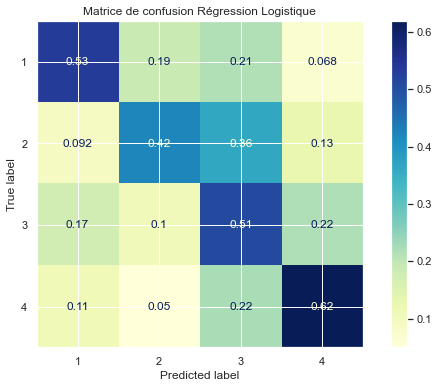
    


    
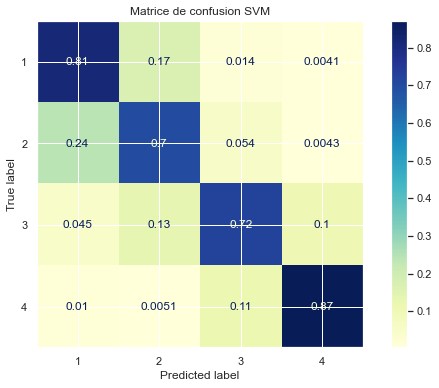
    


    

    


```python
'''
Transformation du vecteur y_test
en matrice binaire de dimension
n x nbre de classe
'''

y_test_bin = label_binarize(y_test, classes=df_ml['Top Rang'].unique())
n_classes = y_test_bin.shape[1]

for name, clf in zip(names, classifiers):

    y_score = clf.fit(X_train, y_train).decision_function(X_test)

    # Calcul de la courbe et de l'aire de la courbe ROC pour chaque classe
    fpr = dict()
    tpr = dict()
    roc_auc = dict()
    for i in range(n_classes):
        fpr[i], tpr[i], _ = roc_curve(y_test_bin[:, i], y_score[:, i])
        roc_auc[i] = auc(fpr[i], tpr[i])

    plt.figure(figsize=(10, 6))
    lw = 2
    colors = ['r', 'b', 'g', 'm']

    for i, color in enumerate(colors):
        plt.plot(
            fpr[i],
            tpr[i],
            color=color,
            lw=lw,
            label="Courbe ROC de la classe {0} (aire = {1:0.2f})"
            .format(i+1, roc_auc[i]))

    plt.plot([0, 1], [0, 1], color="navy", lw=lw, linestyle="--")
    plt.xlim([0.0, 1.0])
    plt.ylim([0.0, 1.05])
    plt.xlabel("Taux de Faux Positif")
    plt.ylabel("Taux Vrai Positif")
    plt.title("Courbes ROC {}".format(name))
    plt.legend(loc="lower right")
    plt.show()
```


    
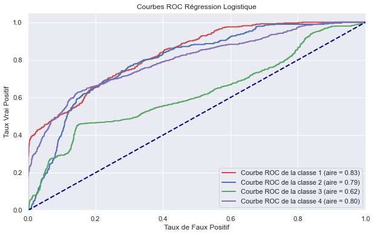
    


    
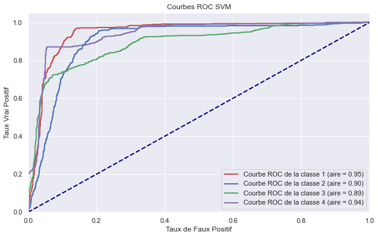
    


    
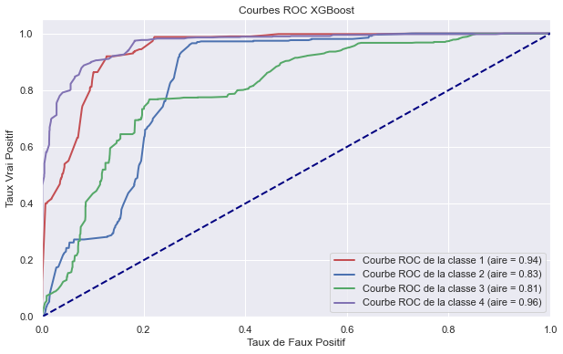
    


```python
def f_importances(coef, names):
    imp = coef
    imp, names = zip(*sorted(zip(imp, names)))
    plt.barh(range(len(names)), imp, align='center')
    plt.yticks(range(len(names)), names)
    plt.show()
```


```python
features_names = X.columns
clf_LR = classifiers[0]
clf_LR.fit(X_train, y_train)

for i in range(clf_LR.coef_.shape[0]):
    print('Importance des coefficients de la régression logistique',
          'pour la classe {}'.format(i + 1))
    f_importances(clf_LR.coef_[i], features_names)
```

    Importance des coefficients de la régression logistique pour la classe 1


    
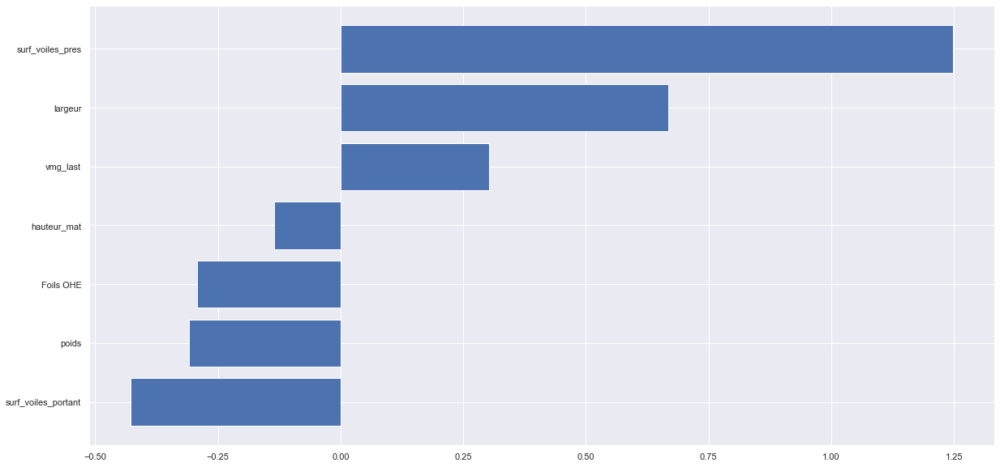
    


    Importance des coefficients de la régression logistique pour la classe 2


    
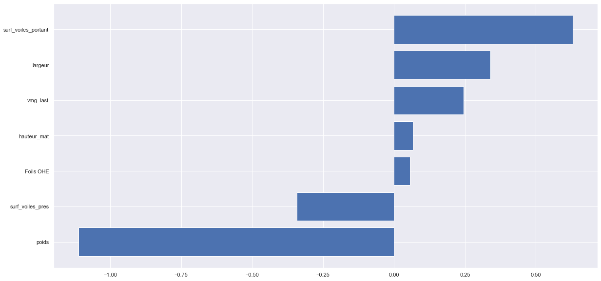
    


    Importance des coefficients de la régression logistique pour la classe 3


    
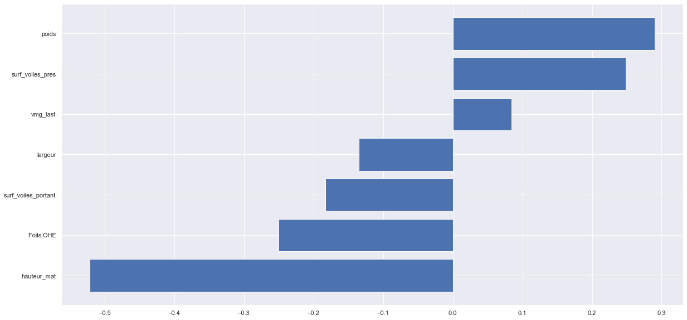
    


    Importance des coefficients de la régression logistique pour la classe 4


    
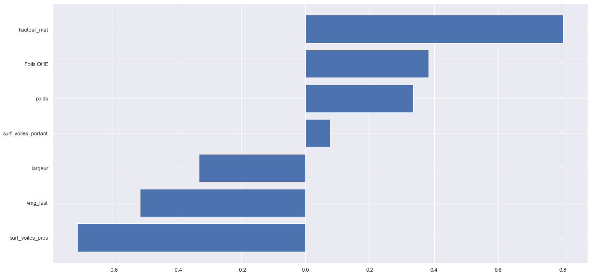
    


```python
features_names = X.columns
clf_XGB = classifiers[2]
clf_XGB.fit(X_train, y_train)
print('Importance des coefficients de XGBoost')
f_importances(clf_XGB.feature_importances_, features_names)
```

    Importance des coefficients de XGBoost


    
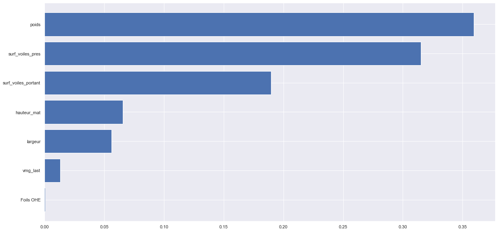
    


À partir des matrices de confusion et des courbes ROC, nous observons que les algorithmes SVM avec un noyau non linéaire et XGBoost sont ceux qui parviennent le mieux à prédire la classe du rang des skippers. La classe 3 (rang de 10 à 15) semble la plus difficile à prédire pour l'algorithme XGBoost. Au vu de notre objectif qui serait de prédire le top 10 des skippers, les performances des algorithmes de SVM et XGBoost sont acceptables malgré un écart-type autour de 10% pour les scores de validation croisée.
De plus, l'expérience et les compétences de navigation du skipper ainsi que d'autres facteurs sont certainement des variables complémentaires permettant d'expliquer le rang de celui-ci. Ces données ne sont pas prises en compte dans notre modèle, ce qui peut expliquer la différence entre notre prédiction et le classement réel.


```python

```
